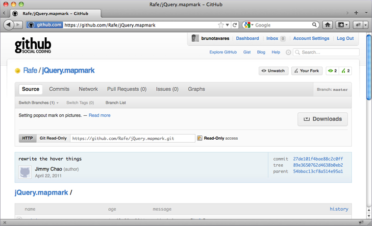

# jQuery.markmap

Enables map mark feature on images and other elements from website. This enables you to give some further details
and explanations about something in your website/app.

Forked project from [/Rafe/jQuery.mapmark](https://github.com/Rafe/jQuery.mapmark).

##Instalation 

Include jQuery and MarkMap files:
	<code>
		
		<link rel="stylesheet" href="mapmark/jQuery.mapmark.css" type="text/css"/>
		 
	</code>

##Usage:
Create HTML markup as below:
	<code>
		

		
			<!-- the image -->
			
			
			<!-- the markers (positioned by css)--> 
			

			

	
			<!-- the popouts (positioned automatically) -->
			

				

				

					... example ...
				

			

			
 ... 

	
		

	</code>

Position you markers with CSS:
	<code>
		/*
		 * Markers (top, left relative to #canvas)
		 */
		#mark-1{ top:80px; left: 105px; }
		#mark-2{ top:135px; left: 715px; }
		#mark-3{ top:233px; left: 700px; }
		#mark-4{ top:170px; left: 350px; }
	</code>
	
Init Javascrit controll:
	<code>
		$("#canvas1").mapmark(".mark",".popout");
	</code>

##Additional Features:

Change action from click, to hover:
	<code>
		$("#canvas1").mapmark(".mark",".popout",{action:"hover"});
	</code>

Change theme to black adding CSS class to MapMark root element:
	<code>
		

			...
		

	</code>
##TODO
+ fix hover bug
+ check original project todos